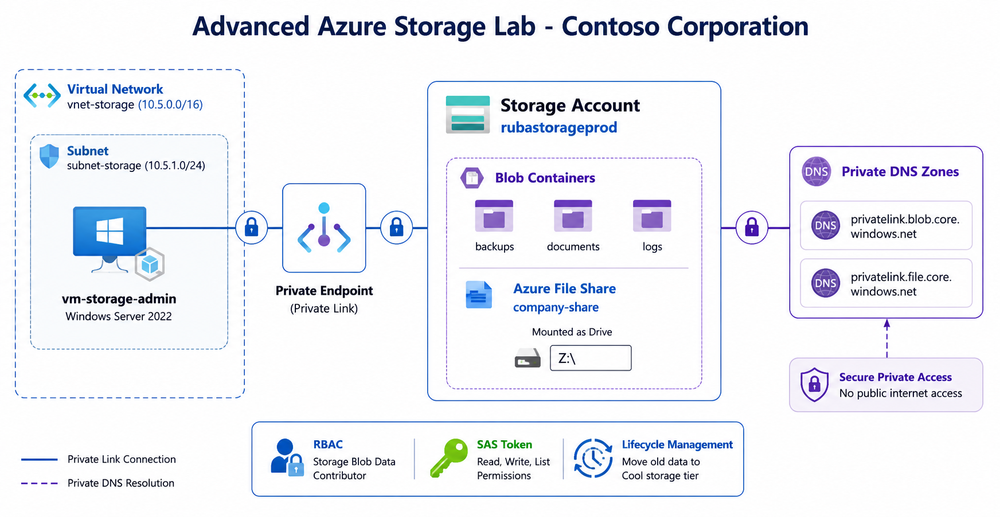

# Advanced Azure Storage & Secure Connectivity Lab

**Blob Storage + Azure Files + Private Link + RBAC + SAS + Lifecycle Management**

## 🎯 Scenario
**Contoso Corporation** needs a secure, scalable storage solution for shared files, backups, and application data with private access only.

## 🏗️ Architecture

## 🛠️ What You Will Implement
- General Purpose v2 Storage Account
- Blob Containers
- Azure File Shares
- Private Endpoints + Private DNS
- RBAC & SAS Tokens
- Storage Explorer Management
- Lifecycle Management

## 📋 Lab Files
- [Step-by-Step Guide](./Step-by-Step-Guide.md)
- [Verification & Testing](./Verification.md)

**Lab Completed Successfully!** 🎉

---

⭐ Star this repo if it helped you with AZ-104!
